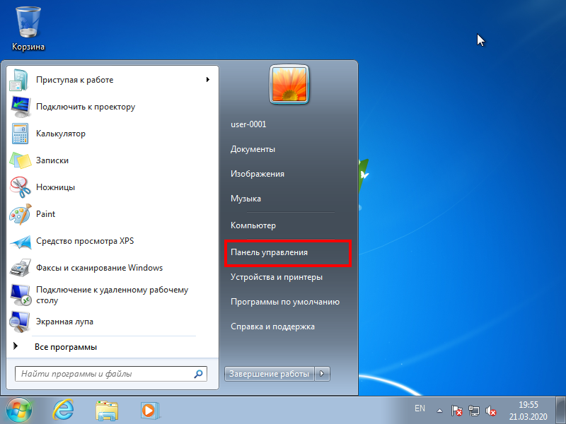
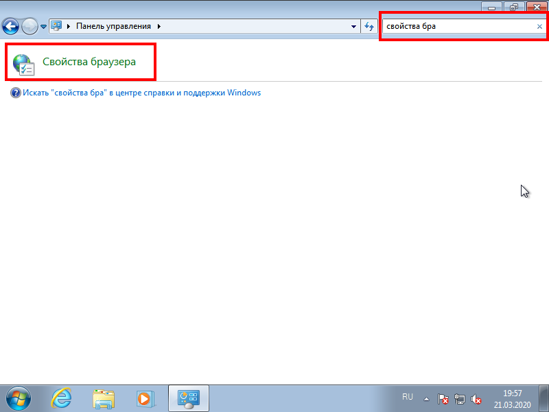
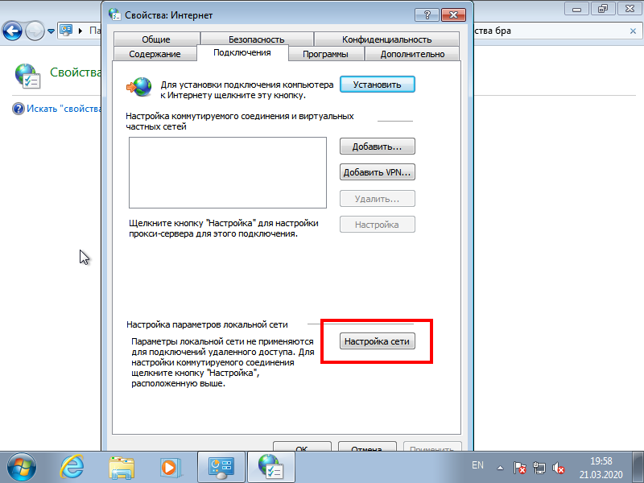
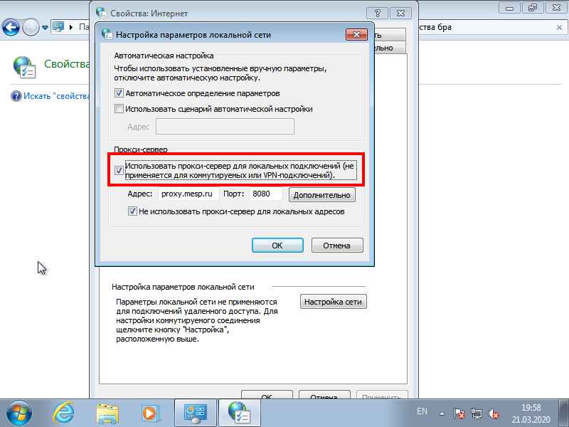
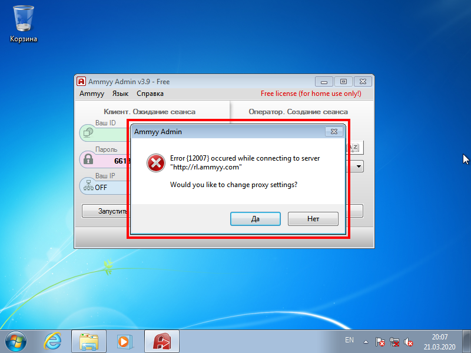
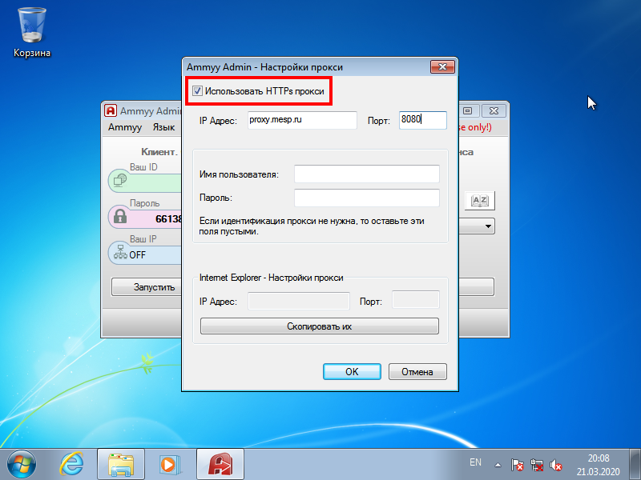
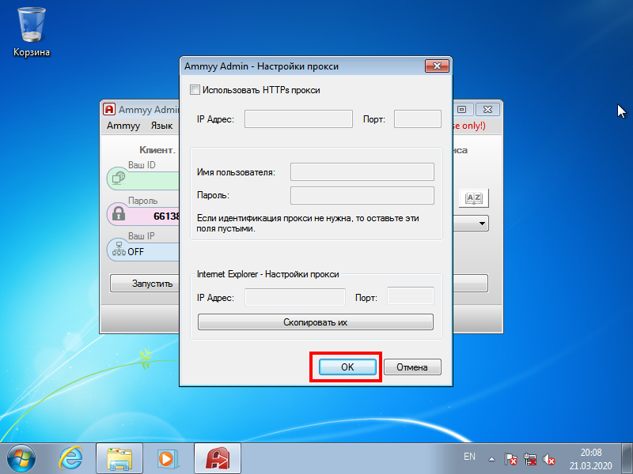

Если Вы вывезли рабочий компьютер организации к себе домой, Вам необходимо изменить некоторые параметры этого компьютера.

## Настройка рабочего компьютер организации

1. Откройте меню **Пуск** и нажмите на пункт **Панель управления**.  

2. В правом верхнем поле ввода *Поиск в панели управления* введите `свойства бра` и нажмите на **Свойства браузера**.  

3. В открывшемся окошке перейдите на вкладку **Подключения** и нажмите на кнопку **Настройка сети**.  

4. Уберите галочку *Использовать прокси-сервер для локальных подключений (не применяется для коммутируемых или VPN-подключений)*. Если галочка уже убрана, то это значит, что настройки Вам сделали заранее работники ИТ отдела.  

5. Нажмите кнопку **ОК**.  

Готово! Теперь Ваш рабочий компьютер готов к подключению домашнего интернета.

## Настройка программы удалённой работы

Если программа удалённого доступа при запуске показывает следующее окно:

То, необходимо проверить и выполнить следующие действия:

1. Нажмите кнопку **Да**.
2. Уберите галочку *Использовать HTTPs прокси*.  

3. Нажмите кнопку **ОК**.  

4. Закройте программу и запустите её заново.
