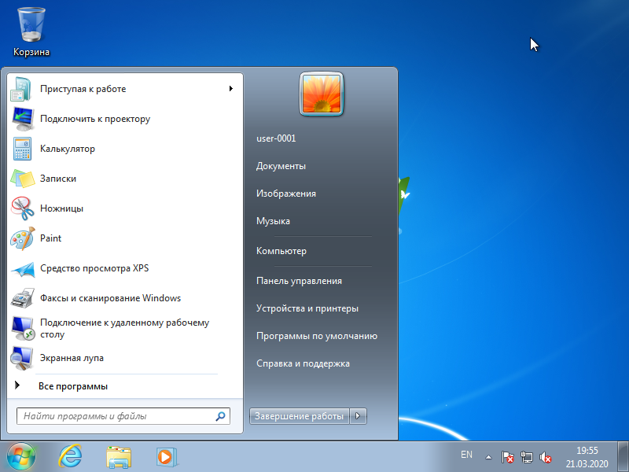

Если Вы вывезли рабочий компьютер организации к себе домой, Вам необходимо изменить некоторые параметры этого компьютера.

#### Настройка рабочего компьютер организации дома

1. Откройте меню **Пуск**.
2. Нажмите на пункт **Панель управления**.  

3. В правом верхнем поле ввода *Поиск в панели управления* введите `свойства бра`.
4. Нажмите на **Свойства браузера**.
5. В открывшемся окошке перейдите на вкладку **Подключения**.
6. Нажмите на кнопку **Настройка сети**.
7. Уберите галочку *Использовать прокси-сервер для локальных подключений (не применяется для коммутируемых или VPN-подключений)*
8. Нажмите кнопку **ОК**.

Готово! Теперь Ваш рабочий компьютер готов к подключению домашнего интернета.