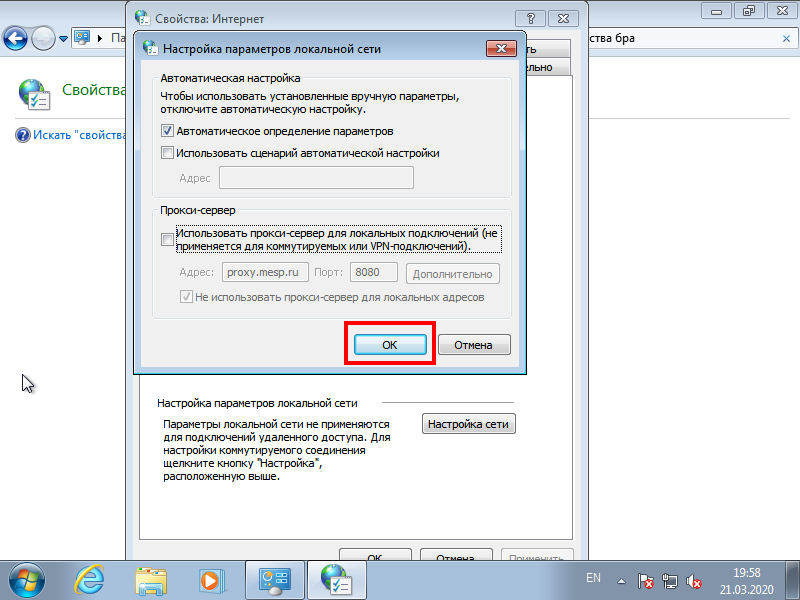

Если Вы вывезли рабочий компьютер организации к себе домой, Вам необходимо изменить некоторые параметры этого компьютера.

#### Настройка рабочего компьютер организации дома

1. Откройте меню **Пуск** и нажмите на пункт **Панель управления**.  

3. В правом верхнем поле ввода *Поиск в панели управления* введите `свойства бра` и нажмите на **Свойства браузера**.  

5. В открывшемся окошке перейдите на вкладку **Подключения** и нажмите на кнопку **Настройка сети**.  

7. Уберите галочку *Использовать прокси-сервер для локальных подключений (не применяется для коммутируемых или VPN-подключений)*.  

8. Нажмите кнопку **ОК**.  

Готово! Теперь Ваш рабочий компьютер готов к подключению домашнего интернета.