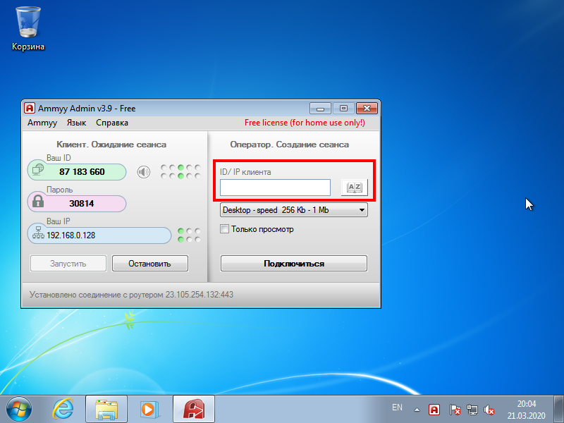
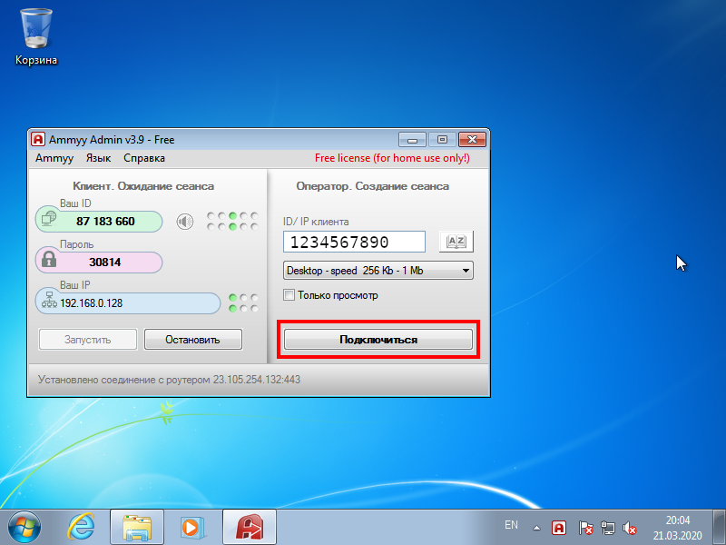

Для того, чтобы работать с программой удалённого доступа, Вам необходимы:

1. **Стабильный** домашний интернет.
2. Компьютер или ноутбук на операционной системе **Windows**.
3. Программа для подключения к удалённому компьютеру (программа удалённой работы).

## Настройка программы удалённой работы

1. Скачать архив с программой по [ссылке](https://github.com/ru-aoesp/ru-aoesp.github.io/raw/master/storage/Удаленная_работа.zip).
2. Распаковать скаченный архив.
3. Запустить программу **Удаленная работа**.
4. Сообщите сотруднику ИТ отдела **Ваш ID**, выданный программой для регистрации лицензии.
5. В разделе **Оператор. Создание сеанса** (правая часть окна программы) ввести числовой идентификатор удалённого компьютера в поле **ID/IP клиента** (`1234567890` - это **ПРИМЕР**).

6. Нажать кнопку **Подключиться** (`1234567890` - это **ПРИМЕР**).

7. Ввести пароль, который сообщили Вам сотрудники ИТ.
8. Подождать около 1 минуты, пока программа настроит связь между домашним и удалённым компьютером.
