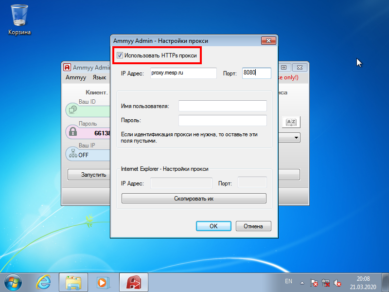

## Вопрос

У меня не подключается к удалённому компьютеру.

## Ответ

Работа в режиме удалённого доступа предполагает две вещи:

1. Качественный домашний интернет.
2. Наличие программы удалённого доступа.

Проверьте, есть ли у Вас домашний интернет и всё ли с ним в порядке.

---

Если у Вас при запуске программы вылетает подобное окно:

То, необходимо проверить и выполнить следующие действия:

1. Нажмите кнопку **Да**.
2. Уберите галочку *Использовать HTTPs прокси*.  

3. Нажмите кнопку **ОК**.  

4. Закройте программу и запустите её заново.

---

Если у Вас в окне программы в зелёном поле указанно слово ERROR, как показано на рисунке:

А галочка *Использовать HTTPs прокси*, как было показано выше, снята, то Вам необходимо проверить соединение с интернетом на домашнем компьютере. У Вас проблемы с интернетом.